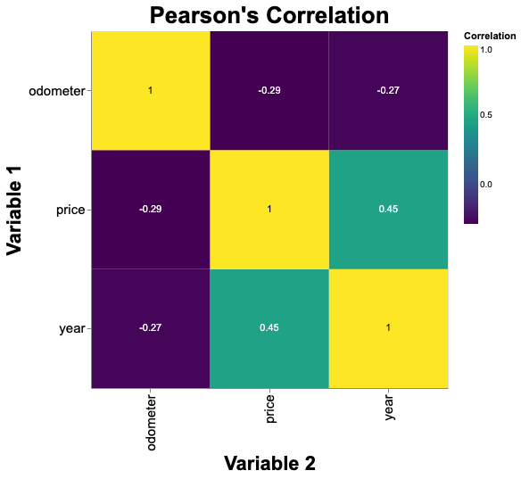

# Project proposal 

## The Data
In this project, we will be conducting an analysis on the "Used Cars Dataset" from [Kaggle.com](https://www.kaggle.com/austinreese/craigslist-carstrucks-data). This dataset consists of Craigslist postings in the US that
contains the price of the listed vehicle and various features such as year, manufacturer, model, listed condition and odometer of the vehicle along with 9 other potential features that determine price. 

## Research Question
We will develop a model to answer the predictive question:   
**What is the predicted market price given a set of features of a car?**

If time permits, our subquestion will be:  
**What features are most important in predicting the market price of a used car?**  

## Analysis Plan of Action
The full dataset is roughly 1.4 GB in size so we will be taking a sample to improve the time and efficiency of our initial stages of the model building. We will be splitting the data to appropriate training, validation, and test sets in order to prevent biassing the results before conducting any analysis. Since we have a lot of data (~500 000 examples), we can afford to perform a more liberal split such as a 90/10 split to obtain a more accurate model. 

We will be attempting to fit support vector regression, stochastic gradient descent regression, linear regression, K-nearest neighbour regression, and random forest regression models because our target variable is continuous. Since our features are mostly categorical with numerous levels, we realized it will probably not be linearly separable, and the most appropriate models would probably be kNN, ensemble methods (like random forests and boosted trees) and SVM RBF. We believe SVM RBF worked best because our data is highly clustered, and that's where this model performs great. Random / boosted forests were also expected to work well due to the same reason, but SVM still performed better eventually.  

We will tune hyperparameters of each model using k-fold cross-validation where the number of folds will most likely be small due to the fact that we have a lot of data and it's not necessary to have a large number of folds. We will be using $R^2$ to evaluate our models. We will compare all the model scores and select the model based on the highest combination of training and validation scores. After selecting our best model, we will retrain it on the entire training set and perform final predictions  on the test set. 

## Exploratory Data Analysis
We will perform an [EDA](https://github.com/UBC-MDS/DSCI_522_Group-308_Used-Cars/blob/master/eda/EDA.ipynb) to get an overview of basic summary statistics, if there exists any outliers or eroneous data points, determining correlations between variables, if there exists multicollinearity in the data, and identifying which features we think will be most important. If there are any major outliers and erneous data points, we will remove them from the dataset otherwise they could potentially skew our results. This EDA will help us understand the data and extract insights that will guide us further in our analysis. 

- A figure for a pearson's correlation matrix may be handy in determining if variables are redundant and may suggest variable importance.   

- A table for frequency of features will help determine where there are imbalances within the data which can be crucial to the interpretations of our results. 

## Communication of Results
For our final results, we will be creating a markdown report that will contain an overview of our model including specifications and justifications. We will present a table of the train and validation scores of all of our models and present a set of examples of what are model predicts. 
